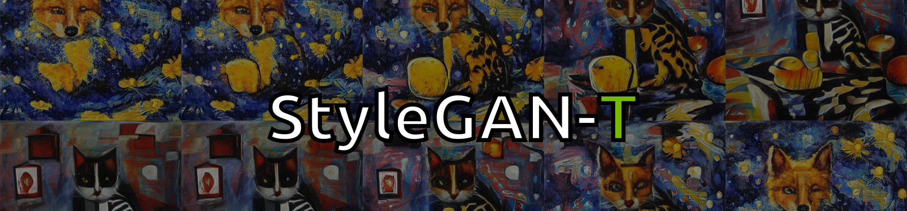

#### [[Project]](https://sites.google.com/view/stylegan-t/)    [[PDF]](https://arxiv.org/abs/2301.09515)    [[Video]](https://www.youtube.com/watch?v=MMj8OTOUIok) 
This repository will contain code for our paper "StyleGAN-T: Unlocking the Power of GANs for Fast Large-Scale Text-to-Image Synthesis".

__Code coming soon.__

If you find our paper useful, please cite
```bibtex
@InProceedings{Sauer2023ARXIV,
  author    = {Axel Sauer and Tero Karras and Samuli Laine and Andreas Geiger and Timo Aila},
  title     = {StyleGAN-T: Unlocking the Power of GANs for Fast Large-Scale Text-to-Image Synthesis},
  journal   = {arXiv.org},
  volume    = {abs/2301.09515},
  year      = {2023},
  url       = {https://arxiv.org/abs/2301.09515},
}
```

## Related Projects ##
- [Projected GANs Converge Faster (NeurIPS'21)](https://github.com/autonomousvision/projected-gan)
- [StyleGAN-XL: Scaling StyleGAN to Large Diverse Datasets (SIGGRAPH'22)](https://github.com/autonomousvision/stylegan-xl)
